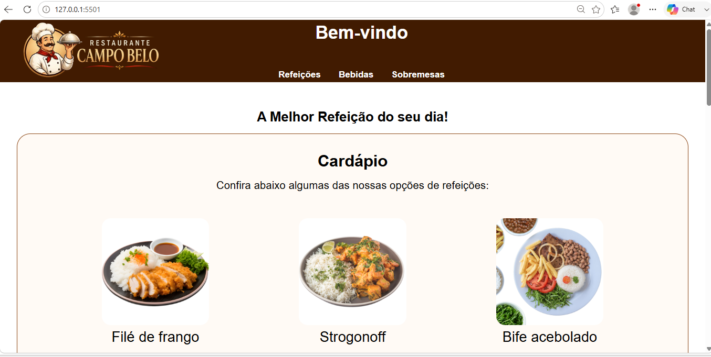

# Restaurante Campo Belo

Projeto desenvolvido como prática dos estudos de HTML5 e CSS3 durante o curso de Programador de Sistemas e Web.

## Tecnologias utilizadas

* HTML5
* CSS3
* Flexbox

## Funcionalidades

* Cabeçalho com navegação por âncoras
* Seções de Cardápio, Sobremesas e Bebidas
* Galeria de imagens dos pratos
* Layout organizado com Flexbox
* Rodapé com informações de contato
* Layout responsivo, adaptado para dispositivos móveis

## Objetivo

Praticar a criação de um site institucional simples utilizando HTML semântico, organização de arquivos e estilização com CSS puro.

Este projeto faz parte da minha evolução como estudante de Análise e Desenvolvimento de Sistemas e representa uma das primeiras páginas completas desenvolvidas por mim durante o processo de aprendizagem.

## Preview

## Changelog

### v2 - 02/08/2026
* Corrigido bug no favicon e ativados os links do menu (âncoras)
* CSS unificado (DRY) com as classes `.secao` e `.imagem-item`
* Adicionada responsividade mobile: header com `position: static`, menu com `flex-wrap`, `box-sizing: border-box` para corrigir a largura das seções e o `max-width` impediu o menu de vazar da tela.